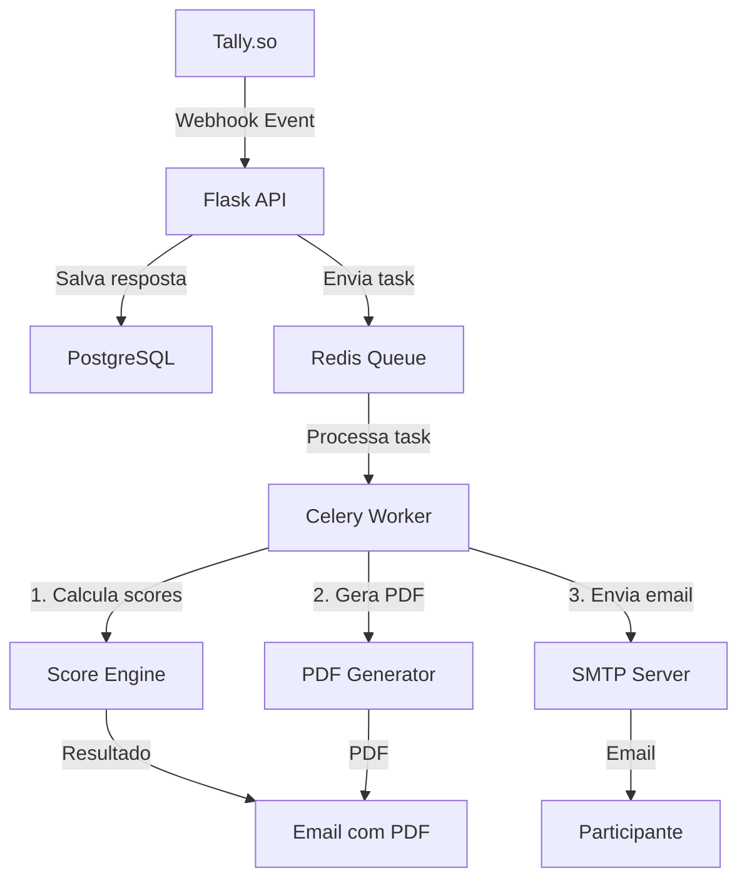
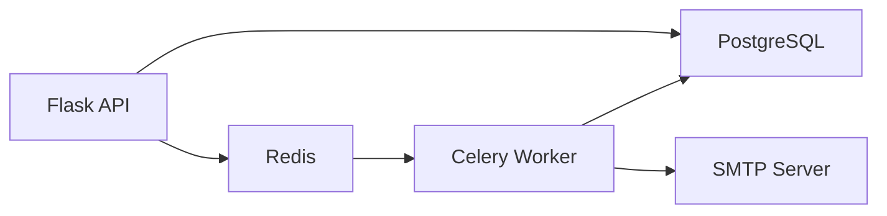

# Insper Code Na Prática - Sistema de Processamento de Formulários

## 📋 Visão Geral

Sistema de processamento de formulários que recebe eventos de webhook do Tally.so, processa as respostas de forma assíncrona e gera relatórios personalizados para participantes.

**Stack**: Flask + Celery + PostgreSQL + Redis

## 🏗️ Arquitetura



## 🔄 Como funciona?

### 1. Recebimento do Webhook
- Flask API recebe evento do Tally.so
- Valida e salva resposta no banco de dados
- Retorna ID do registro para uso na Task

### 2. Processamento Assíncrono
O Celery Worker executa 3 tarefas principais:

#### 📊 Cálculo de Scores
- Analisa respostas do formulário
- Aplica algoritmos de pontuação
- Gera métricas personalizadas

#### 📄 Geração de PDF
- Utiliza template base fornecido
- Preenche com dados do participante
- Gera relatório personalizado

#### 📧 Envio de Email
- Configuração SMTP
- Anexa PDF gerado
- Envia para o participante

## 🐳 Infraestrutura Docker

### Serviços Containerizados



## 🚀 Deploy com Docker

### 1. Configurar variáveis de ambiente
```bash
cp .env.example .env
```

Editar `.env` com as configurações necessárias:

#### 🔑 Configuração do Tally

1. **Criar chave de API no Tally**:
   - Acesse [Tally.so](https://tally.so)
   - Vá em **Settings** → **API keys**
   - Clique em **Create API key**
   - Copie a chave gerada e adicione no `.env`:
     ```env
     TALLY_API_KEY=sua_chave_aqui
     ```

2. **Definir Webhook Secret Key**:
   - Gere uma chave secreta forte (recomendado: 32+ caracteres aleatórios)
   - Adicione no `.env`:
     ```env
     TALLY_WEBHOOK_SECRET=sua_secret_key_aqui
     ```
   - Esta chave será usada para validar a autenticidade dos webhooks

3. **Configurar domínio público**:
   - Defina o domínio onde a aplicação estará disponível:
     ```env
     DOMAIN=https://seu-dominio.com
     ```
   - A URL do webhook será gerada automaticamente como: `{DOMAIN}/api/v1/webhooks`

4. **Configurar SMTP** (necessário para envio de emails com relatórios)

> **Importante**: Guarde a `TALLY_WEBHOOK_SECRET` em segurança. Ela é usada para validar os webhooks recebidos.

> Note que nem sempre gostaríamos de expor as portas dos demais serviços, somente de `app`.

### 2. Configurar webhook no Tally (executar apenas uma vez)

Antes de subir a aplicação, é necessário configurar o webhook no Tally:

```bash
python setup_webhook.py
```

Este script irá:
- Listar seus formulários do Tally
- Permitir selecionar qual formulário receberá o webhook
- Configurar automaticamente o webhook com a URL `{DOMAIN}/api/v1/webhooks`
- Usar a `TALLY_WEBHOOK_SECRET` definida no `.env`

> **Quando executar novamente?**
> - Apenas se você mudar o domínio da aplicação
> - Se precisar trocar o formulário vinculado
> - Se precisar alterar o webhook secret

### 3. Subir todos os serviços
```bash
docker compose up -d
```

### 4. Verificar status
```bash
# Ver logs
docker compose logs -f

# Health check da API
curl http://localhost:5000/api/v1/health/
```

### 5. Gerenciar serviços
```bash
# Parar serviços
docker compose down

# Parar e limpar volumes (remove dados)
docker compose down -v

# Rebuild após mudanças no código
docker compose up -d --build
```

## 📦 Serviços

- **Flask API** (Gunicorn): `localhost:5000`
- **PostgreSQL**: `localhost:5432`
- **Redis**: `localhost:6379`
- **Celery Worker**: processamento assíncrono

---

**Desenvolvido pelo Insper Code para Na Prática** 🎓
